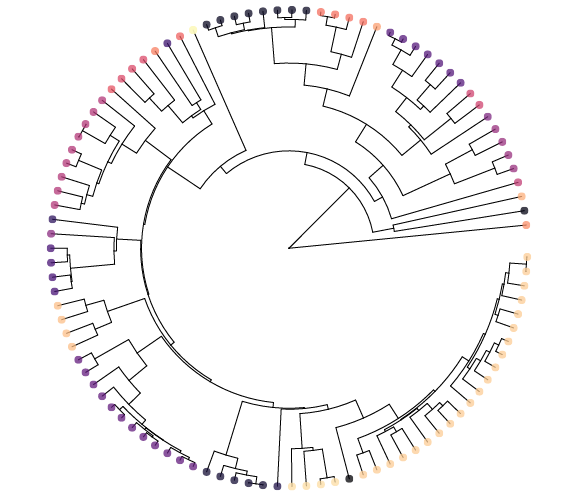

--- 
title: "Research"
output: 
  html_document:
    css: ['CSSBackgrounds.css', 'CSSFonts.css']
    includes:
      after_body: footer.html
---

<!-- This hides the title "Research" from this page, since I wanted to have a display title that is different from the page title.  -->

<!-- This adds the floating image of my study organisms to the right of the text.  -->

#### Fisheries Conservation Research
Large invasive carp now contribute disproportionately to fish catches in the Upper Mississippi River and motivate large-scale management actions to prevent further expansion of the carp invasion front into the Great Lakes. Among the invasive carp, Silver carp (also known as "jumping carp") and Bighead Carp successfully reproduce upstream from high-head navigation dams in the Upper Mississippi River, including the Lock and Dam 19 in Keokuk, IA. Current management actions focused in the Upper Mississippi River include removal strategies, deterrents, and barriers to upstream fish movement. Understanding how environmental factors such as water temperature and river discharge influence reproduction upstream from the Lock and Dam 19, will provide needed feedback on the effectiveness of population control at an invasion front.   

For this project, I am collaborating with my two postdoctoral research advisors in the Department of Natural Resource Ecology and Management at Iowa State University: [Dr. Michael J. Weber](https://michaeljohnweber.wixsite.com/fisherieslab) and USGS Iowa Cooperative Fish and Wildlife Research Unit leader [Dr. Michael J. Moore](https://moorefishlab.weebly.com/), along with commercial anglers, researchers and conservation practitioners in Iowa DNR, Illinois Natural History Survey, Southern Illinois University - Carbondale to examine the reproductive biology of Silver Carp in the Upper Mississippi River. Our objectives are to: (1) assess annual variation in natal origins of Silver Carp using hard-part microchemistry and stable isotope techniques and (2) assess annual variation in recruitment dynamics of invasive Silver Carp in association with environmental conditions. We will determine age from fish otoliths collected in the fall of 2022 and assess the early life environment of Silver Carp using microchemistry analyses to evaluate the proportion of adults from each year-class that recruited upstream or downstream of Lock and Dam 19. 

#### Biodiversity Research

How multiple species originate and co-occur remains a long-lasting enigma in evolutionary ecology. Biodiversity gradients in which most species are endemic represent natural experiments where we can test alternative hypotheses and gain key insights into the complex processes that lead to the buildup of species richness.  

For my PhD dissertation research, I have conducted replicated fish surveys along the bathymetric gradient in Lake Tanganyika, Tanzania, to examine how the ecological context, particularly energy availability, shapes morphological divergence and species richness at a community level using phylogenetic methods (in prep.). This research has unveiled that high-energy areas in shallow waters harbor both elevated community trait diversity and greater endemic species richness via the disproportionate accumulation of rare species.  

My research interests also involve conducting field and laboratory-based experiments that serve as “proof of concept” for available theory in evolutionary ecology. For instance, I have experimentally tested whether predators can help maintain a color-polymorphism in Nicaraguan cichlid fishes for my [master’s thesis](https://besjournals.onlinelibrary.wiley.com/doi/abs/10.1111/1365-2656.12693). More recently, I have piloted behavioral assays testing for intraspecific aggression biases that could help mediate coexistence of sympatric and congeneric fishes in Lake Tanganyika (in prep.). An [idea](https://www.journals.uchicago.edu/doi/abs/10.1086/704169) I am particularly drawn to is the context-dependent nature of specialization, and how food resource availability may shape the evolution of specialized foraging strategies.  

Lastly, using genomic data sets (genotyping-by-sequencing) paired with phenotypic data, I have identified patterns of population genetic differentiation across multiple species of Lake Tanganyikan cichlid fishes (in prep.). Results of this study have provided fascinating insights into the commonalities underlying the process of population divergence and color morph persistence in this exceptional radiation. Moreover, a deeper understanding of the relationship between spatial genetic structure and diversity accumulation at higher organizational levels may be vital to the effective conservation of East African cichlid fishes, as well as other biodiverse, threatened aquatic fauna. Thus, my research aims to obtain a mechanistic understanding of both the origins and maintenance of phenotypic diversity, below and above the level of a species.

### Publications
My [Google scholar](https://scholar.google.com/citations?user=WAxpZLEAAAAJ&hl=en&oi=ao) contains an up-to-date list of my scientific publications so far. Please contact me if you would like access to a pdf of any of these. *A Nature News and Views write-up of one of my publications written by Dr. Sebastian Kruppert and Dr. Adam Summers can be found [here](https://www.nature.com/articles/d41586-019-02008-6?utm_source=twt_nv&utm_medium=social&utm_campaign=newsandviews).

